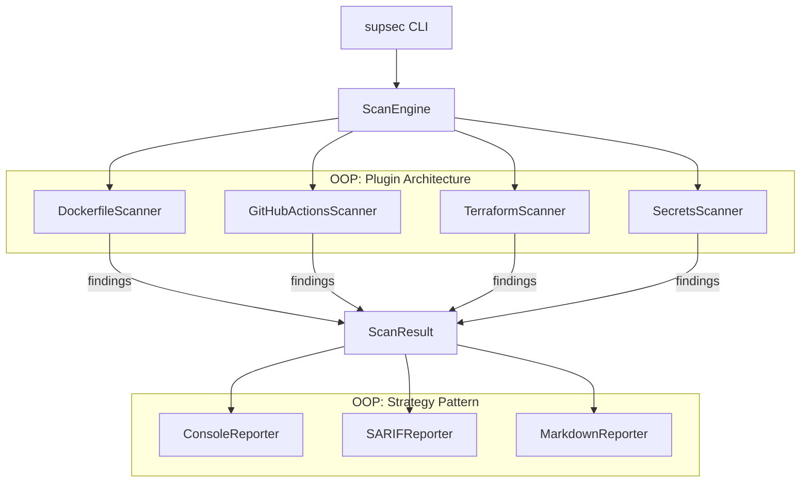

# supSec

> *"Sup, Sec?" — a DevSecOps scanner that finds security issues in Dockerfiles, CI pipelines, Terraform, and source code.*

A Python CLI tool that scans your infrastructure code for security misconfigurations, hardcoded secrets, and compliance violations. Outputs to console, SARIF (GitHub Security tab), or Markdown (PR comments). Blocks deploys when critical issues are found.

## What it scans

| Scanner | Files | Example findings |
|---|---|---|
| **Dockerfile** | `Dockerfile`, `Dockerfile.*` | Running as root, secrets in ENV, curl pipe to bash, no HEALTHCHECK, unpinned base images |
| **GitHub Actions** | `.github/workflows/*.yml` | Missing permissions block, unpinned actions, hardcoded secrets, `pull_request_target` pwn vector |
| **Terraform** | `*.tf` | Unencrypted S3, public RDS, 0.0.0.0/0 security groups, hardcoded credentials, no KMS rotation |
| **Secrets** | All text files | AWS keys (AKIA...), GitHub PATs, OpenAI keys, Stripe keys, private key headers, high-entropy strings |

Every rule maps to industry compliance frameworks: **CIS Benchmarks, PCI-DSS, HIPAA, SOC2, NIST 800-53, OWASP, SLSA**.

## Quick start

```bash
# Install
git clone https://github.com/jmunozti/supSec.git && cd supSec
make install

# Scan a project
supsec scan /path/to/your/project

# Scan with SARIF output (for GitHub Security tab)
supsec scan . --format sarif -o report.sarif

# Scan only Dockerfiles
supsec scan . --scanners dockerfile

# Fail CI on high+ severity (exit code 1)
supsec scan . --fail-on high

# Install as git pre-commit hook
supsec install-hook
```

## Demo: scanning vulnerable vs clean code

```bash
# Scan intentionally vulnerable examples
$ supsec scan examples/vulnerable

┌────────────┬──────────────────────────┬────────────┬─────────────────────────────┐
│ Severity   │ File:Line                │ Rule       │ Message                     │
├────────────┼──────────────────────────┼────────────┼─────────────────────────────┤
│ CRITICAL   │ main.tf:15               │ TF-003     │ RDS instance is publicly... │
│ CRITICAL   │ main.tf:17               │ TF-004     │ Hardcoded credential in...  │
│ CRITICAL   │ Dockerfile:4             │ DOCKER-006 │ Secret value exposed in...  │
│ HIGH       │ Dockerfile:1             │ DOCKER-010 │ No USER instruction         │
│ HIGH       │ main.tf:9                │ TF-002     │ Security group allows 0.0.0.│
│ ...        │                          │            │                             │
└────────────┴──────────────────────────┴────────────┴─────────────────────────────┘

15 findings (3 critical, 5 high, 4 medium, 2 low, 1 info)
BLOCKED — critical or high severity issues must be fixed

# Scan clean examples
$ supsec scan examples/clean

No security issues found.
```

## Architecture



**OOP patterns used:**
- **Abstract Base Class** — `BaseScanner` and `BaseReporter` define the interface; scanners/reporters are plugins
- **Strategy Pattern** — reporters are interchangeable output strategies selected at runtime
- **Factory** — `get_all_scanners()` and `REPORTERS` registry instantiate the right objects
- **Data Classes** — `Finding`, `ScanResult`, `RuleMetadata` are immutable data carriers

## Compliance frameworks covered

| Framework | Rules mapped |
|---|---|
| **CIS Docker Benchmark** | DOCKER-001 through DOCKER-011 |
| **CIS AWS Foundations** | TF-001, TF-002, TF-003, TF-006, TF-008, TF-010 |
| **PCI-DSS** | DOCKER-006, GHA-003, TF-001, TF-002, TF-003, TF-004, TF-008, SEC-001, SEC-002 |
| **SOC2 (CC6.1, CC7.2)** | DOCKER-006, TF-004, TF-005, TF-009, TF-010 |
| **HIPAA (164.312)** | TF-001, TF-007 |
| **NIST 800-53** | DOCKER-004, TF-002, TF-008 |
| **NIST 800-190** | DOCKER-001, DOCKER-008, DOCKER-010 |
| **OWASP CI/CD Top 10** | GHA-001, GHA-003, GHA-007 |
| **OWASP Supply Chain** | DOCKER-005, GHA-002, GHA-004 |
| **SLSA** | DOCKER-005, DOCKER-008, DOCKER-009, GHA-002 |

## CI/CD integration

### GitHub Actions

```yaml
- name: supSec scan
  run: |
    pip install -e .
    supsec scan . --format sarif -o supsec.sarif --fail-on high

- name: Upload SARIF
  uses: github/codeql-action/upload-sarif@v3
  with:
    sarif_file: supsec.sarif
```

### Pre-commit hook

```bash
supsec install-hook
# or
make hook
```

Blocks commits containing critical/high severity findings.

## Development

```bash
make install     # Install deps
make test        # Run tests (60+ tests)
make lint        # Ruff lint
make fmt         # Auto-format
make scan        # Scan this repo with itself
```

## Tech stack

- **Python 3.12** — Typer CLI, Rich terminal output, PyYAML, Pydantic
- **OOP** — ABC plugin system for scanners and reporters
- **SARIF 2.1.0** — GitHub Security tab integration
- **60+ unit tests** — pytest, fixtures, parametrized
- **Ruff** — linting and formatting
- **GitHub Actions** — CI with self-scan (supSec scans its own repo)

## License

MIT
