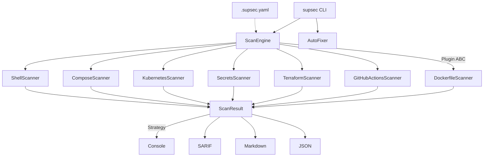

<p align="center">
  
</p>

# supSec

> *"Sup, Sec?" — DevSecOps scanner for Dockerfiles, CI pipelines, Terraform, K8s manifests, Compose files, shell scripts, and secrets.*

Scans infrastructure code for security misconfigurations and compliance violations. Blocks deploys when critical issues are found. Outputs to console, SARIF (GitHub Security tab), Markdown, or JSON.

## Scanners (7) and rules (49)

| Scanner | Files | Key findings |
|---|---|---|
| **Dockerfile** | `Dockerfile*` | Root user, secrets in ENV, curl\|bash, no HEALTHCHECK, unpinned images |
| **GitHub Actions** | `.github/workflows/*.yml` | Missing permissions, unpinned actions, hardcoded secrets, pwn request vector |
| **Terraform** | `*.tf` | Unencrypted S3, public RDS, open SGs, hardcoded creds, no KMS rotation |
| **Kubernetes** | K8s manifests | Privileged containers, no securityContext, no resource limits, no readOnlyRootFilesystem |
| **Docker Compose** | `docker-compose.yml` | Privileged, host network, docker.sock mount, secrets in environment |
| **Shell** | `*.sh`, `*.bash` | eval, curl\|bash, unquoted rm, chmod 777, missing set -euo pipefail |
| **Secrets** | All text files | AWS keys, GitHub PATs, OpenAI keys, Stripe keys, private keys, high-entropy strings |

Every rule maps to compliance frameworks: **CIS Benchmarks, PCI-DSS, HIPAA, SOC2, NIST, OWASP, SLSA**.

## Quick start

```bash
git clone https://github.com/jmunozti/supSec.git && cd supSec
uv sync

uv run supsec scan /path/to/project          # scan a project
uv run supsec scan . --scanners kubernetes    # only one scanner
uv run supsec scan . --fmt sarif -o out.sarif # SARIF for GitHub Security tab
uv run supsec scan . --fmt json | jq          # JSON for scripting
uv run supsec scan . --changed-only           # only git-changed files
uv run supsec scan . --fail-on high           # exit 1 on high+ severity
uv run supsec fix . --dry-run                 # preview auto-fixes
uv run supsec fix .                           # apply fixes
uv run supsec install-hook                    # git pre-commit hook
```

## Demo

```bash
$ uv run supsec scan examples/vulnerable

 CRITICAL  main.tf:19         TF-003      RDS instance is publicly accessible
 CRITICAL  main.tf:20         TF-004      Hardcoded credential in Terraform
 CRITICAL  Dockerfile:5       DOCKER-006  Secret in ENV instruction
 CRITICAL  deploy.yaml:19     K8S-003     Privileged container
 HIGH      docker-compose:5   COMPOSE-001 Privileged container in Compose
 HIGH      deploy.sh:4        SHELL-005   Hardcoded credential in shell script
 ...

54 findings (10 critical, 21 high, 15 medium, 4 low, 4 info)
BLOCKED

$ uv run supsec scan examples/clean
No security issues found.
```

## Architecture



**OOP patterns:** Abstract Base Class (plugin scanners/reporters), Strategy (output format), Factory/Registry, Template Method (`scan_tree`), Data Classes.

## Config (`.supsec.yaml`)

```yaml
ignore_paths: [vendor/, "*.min.js"]
ignore_rules: [DOCKER-011]
severity_overrides:
  DOCKER-011: HIGH
scanners: [dockerfile, terraform, secrets]
```

## CI/CD

```yaml
# GitHub Actions
- uses: astral-sh/setup-uv@v4
- run: |
    uv sync
    uv run supsec scan . --fmt sarif -o supsec.sarif --fail-on high
- uses: github/codeql-action/upload-sarif@v3
  with: { sarif_file: supsec.sarif }
```

## Tech stack

| | |
|---|---|
| Python 3.12 | Typer CLI, Rich, PyYAML, Pydantic |
| uv | Package manager |
| OOP | ABC plugin system (7 scanners, 4 reporters) |
| 120 tests | pytest |
| Ruff | Lint + format |
| SARIF 2.1.0 | GitHub Security tab compatible |
| GitHub Actions | CI with self-scan |

## License

MIT
